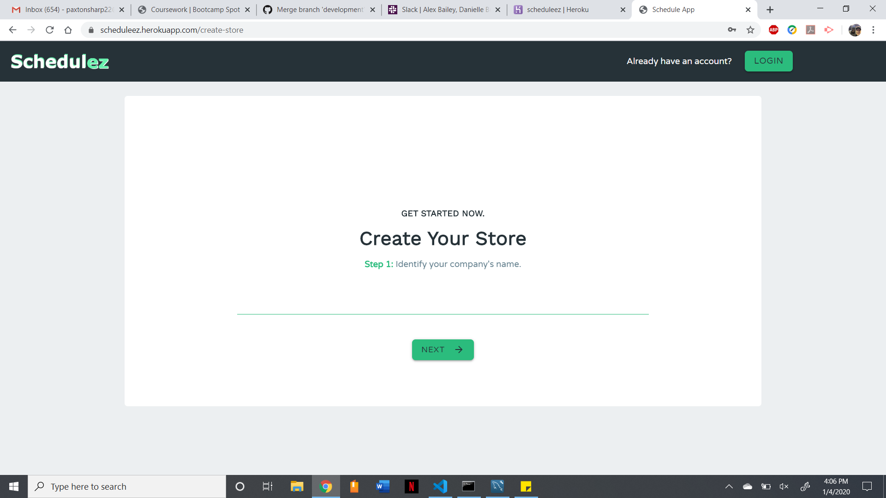
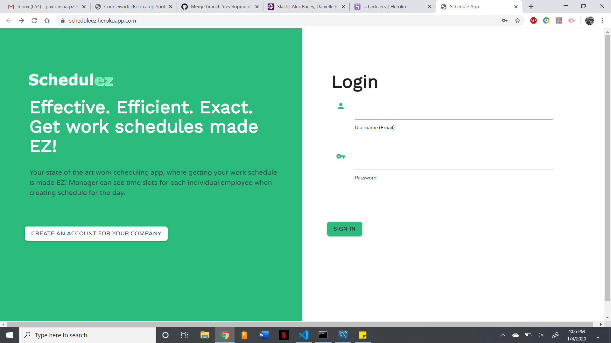

# project2 - SchedulEZ

# Your state of the art work scheduling app, where getting your work schedule is made EZ!

In this app the employee and the management are able to do the following:

- Employees create their own schedule they can work when they sign up
- Manager can see time slots for each individual employee when creating schedule for the day
- Select boxes: employee selects exact times and dates to create their schedule

e

 # Log-in Functionality
Admin status accounts
Employee status accounts

# Ability To Request Time Off
Only admin can approve time off 

# Databases & Data Storage
- Data for all employees, managers, stores, requests, and schedule times are kept in MySQL Databases

Structure of Models: 
- Companies Database 
- Company: Auto-incrementing ID 
- Name 

Locations Database:
- Location: Auto-incrementing ID
- Company: Auto-incrementing ID 
- Address
- City
- State ID  
- Default Hours: Opening and closing hours 

Employees:
- Employee: auto-incrementing ID 
- Location: auto-incrementing ID
- Password
- Status (employee or manager)
- Role
- PT/FT Status

Availability:
(Consistent unless there is a requested change)
https://jqueryui.com/datepicker/#date-range
Moment.js for standardization 
Employee auto-incrementing ID
Monday (baseline)
Tuesday (baseline)
Wednesday (baseline)
Thursday (baseline)
Friday (baseline) 
Saturday (baseline)
Sunday (baseline) 
Request Approved / Pending / Denied 

Requests: 
- Employee auto-incrementing ID
- Date

Schedule:
- Employee auto-incrementing ID
- Employee requested time 
- Employee current hours cumulative 
- Wage 
- Days of week 
